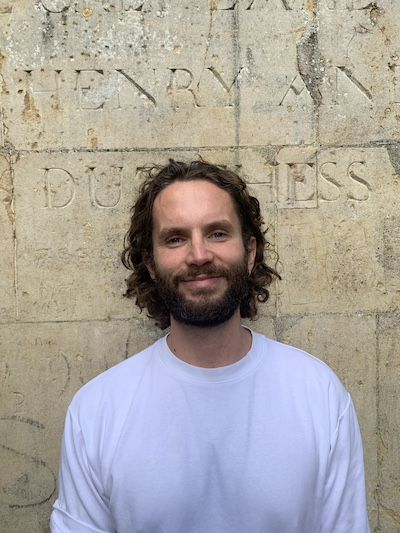

# About Me

 
Hey, I'm **Benjy**!   

I am a Post-Doctoral Research Fellow in the <a href="https://metacoglab.org/">MetaLab</a> at the Functional Imaging Laboratory, UCL. My research spans all things **consciousness**, **perception**, and **numerical** and **social** cognition. 

## What I've been up to

 
 
During my fellowship, I will be working to explore the relationship between neural representations of sensory absence and more high-level, conceptual representations of absence - such as the number zero. In line with this, I am also working on the <a href="https://www.arc-ethos.org/">ETHOS</a> adversarial collaboration - testing the richness of higher-order representations with <a href="https://profiles.ucl.ac.uk/74410-nadine-dijkstra">Nadine Dijkstra</a>. I am also continuing to collaborate with <a href="https://experts.exeter.ac.uk/41202-jonathan-huntley">Jon Huntley</a>, using neuroimaging tools to examine whether patients with Alzheimer's Disease exhibit differences in neural correlates of conscious perception.
 
 
Throughout my PhD, I was working with <a href="https://www.ucl.ac.uk/pals/people/steve-fleming">Steve Fleming</a> and <a href="https://sites.google.com/view/nadinedijkstra/about-me?authuser=0">Nadine Dijkstra</a> at UCL. My research consisted of two broad streams:  **1** exploring how neural magnitude codes may be shared between cognitive domains, and how they might interface with neural correlates of consciousness  **2** adapting social cognition paradigms for use in naturalistic experiments and exploring the interface of social cognition and visual perception.  

Before my PhD, I worked as an RA with <a href="https://www.freemanlab.org/">Jon Freeman</a> at NYU, where I used fMRI to explore how visual awareness facilitates the top-down influence of stereotypes on face perception. Before that, I completed my MSc at the <a href="https://www.sussex.ac.uk/research/centres/sussex-centre-for-consciousness-science/">Sackler Centre for Consciousness Science</a>, where, supervised by <a href="https://sites.google.com/view/keisukesuzuki/home?authuser=0">Keisuke Suzuki</a>, I combined psychophysical experiments with virtual reality models of hallucinations.

